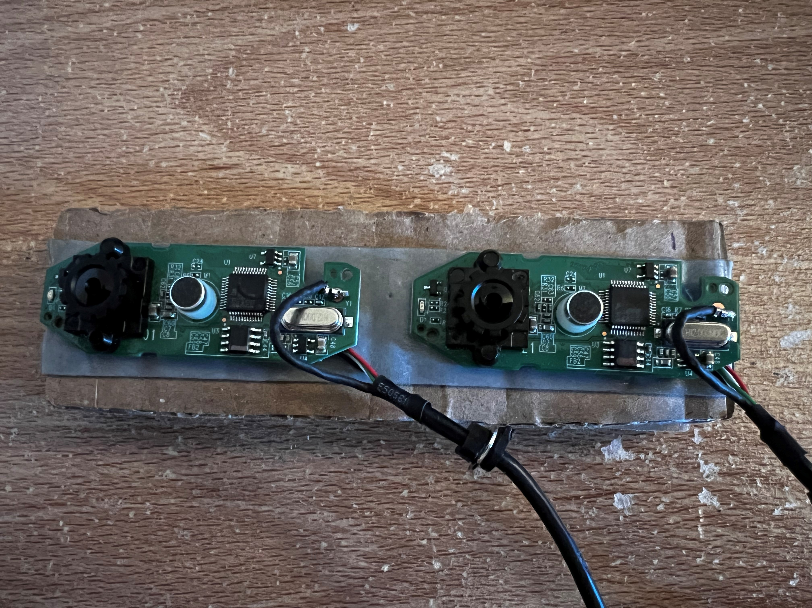

##How To Run
To run this complete code you need to have a stereo camera pair similar to this: 

These are two Logitech C270 cameras with the casing removed and taped onto a cardboard.

- Then you need to run the calibration_images.py file and take calibration images to calibrate the cameras. You have to hit the "s" key for the program to save your images. Please refer to the [images file]() to have an idea of how to take the calibration images. Take at least 20 photos for a good calibration
- Run the stereo_camera_calibration.py
- Run calibrated_view to verify you calibration is correct
- Run disparity_view to have a view of the disparity map and the obstacle detection algorithm
